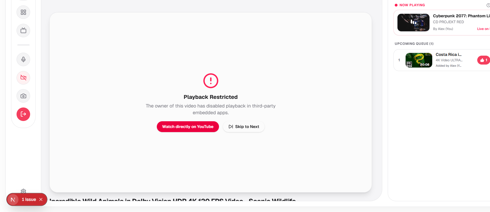

# Immediate Next Steps & Roadmap (TODO)

The frontend architecture, responsive 3-column UI, theme engine, and local state management are complete (Phases 1–3). Follow this phased engineering sequence:

---

## 🟢 Phase 1–3: Frontend UI, UX & State (COMPLETED)

- [x] Responsive 3-column desktop shell & mobile slide-up sheet (`RoomShell.tsx`, `RoomSidebar.tsx`, `RoomClientView.tsx`, `MobileBottomSheet.tsx`).
- [x] Dark "Tap House Gold" and Light minimalist theme system (`useRoomTheme.ts`, `globals.css`).
- [x] Cinema player viewport with ambient backlighting, dipped notch, and floating transport controls (`CinematicVideoPlayer.tsx`).
- [x] Multi-participant grid view mode (`GridStageView.tsx`).
- [x] Chat, React (Web Audio API soundboard), and Users sidebar tabs (`ParticipantSidebar.tsx`).
- [x] Photo snapshot album with screen shutter flash overlay (`CapturedMomentsModal.tsx`).
- [x] Settings modal, invite modal, screen share modal, create room modal.
- [x] Unified local state management with Zustand (`useRoomStore.ts`).
- [x] Dependencies installed in `package.json`: `partykit`, `partysocket`, `react-youtube`, `framer-motion`.

---

## 🟢 Phase 4: Watch Party Sync (Default Mode — COMPLETED)

_Objective: Achieve rock-solid multi-browser synchronized YouTube playback and real-time chat before touching browser control._

- [x] **PartyKit WebSocket Signaling Server**:
  - [x] Initialize a PartyKit server project or config within the workspace.
  - [x] Start the PartyKit development server and wire `partysocket` in `useRoomStore.ts` to establish a basic connection (User verifies `Connection opened` logs in terminal).
  - [x] Implement room connection handling (`onConnect`, `onMessage`, `onClose`) with room IDs and client presence.
  - [x] Add frontend logs for receiving participant updates (User opens two tabs to verify logs of users joining/leaving).
- [x] **Real YouTube IFrame Integration**:
  - [x] Replace the mock background poster in `CinematicVideoPlayer.tsx` with the `react-youtube` (`YT.Player`) component.
  - [x] Add `console.log` for player events (`onReady`, `onStateChange`) (User clicks play/pause and verifies logs).
  - [x] Bind local player events to the Zustand store.
- [x] **Authoritative Playback Synchronization**:
  - [x] Designate the room Host as the authoritative clock source.
  - [x] Broadcast timestamped playback clock packets (`play`, `pause`, `seekTo`).
  - [x] Add frontend logs on guest clients when a playback packet is received (User verifies packet arrival in second tab).
  - [x] Implement drift correction on non-host clients:
    - _Drift > 1.5s_: Hard seek to host position.
    - _Drift 0.3s–1.5s_: Smooth rate throttle (e.g., 0.95x or 1.05x) to catch up without audio pop.
- [x] **Real-Time Social Sync**:
  - [x] Broadcast chat messages and log them upon receipt across WebSocket.
  - [x] Broadcast floating emoji reaction bursts and log origin coordinates.
  - [x] Synchronize participant presence and role updates (Host, Moderator, Participant).

---

## 🟡 Phase 5A: Discord-style "Watch Together" (Native YouTube Experience)

_Objective: Transform the watch room into a unified, collaborative YouTube browsing environment. Discovery, searching, and watching are concurrent parts of the same experience. Users can explore YouTube together without disrupting the synchronized playback._

### Step 1: YouTube Mode UI Architecture

- [x] Add `activeWorkspace: "general" | "youtube"` to `useRoomStore.ts`.
- [x] Wire the `RoomSidebar` buttons to switch between workspaces (YouTube button enters YouTube Mode; Screen Share button enters General Mode).
- [x] Create `<YoutubeWorkspaceView />` as the top-level container for the YouTube experience.
- [x] Update `<RoomShell />` to conditionally render `<YoutubeWorkspaceView />` or `<RoomClientView />` based on the active workspace.
- [x] Scaffold the basic layout of the YouTube Workspace (Search header, Main content area, Player area, Discovery Grid) in `YoutubeWorkspaceView.tsx`.
- [x] Ensure the right-side Chat (`ParticipantSidebar`) remains accessible in both modes.

### Step 2: Data & Functionality

1. [x] **Direct URL Pill Bar Enter Feature**:
  - [x] Support entering/pasting any YouTube video or shorts URL (`youtube.com/watch?v=...`, `youtu.be/...`, `youtube.com/shorts/...`) into the floating URL pill bar; pressing **Enter** parses the video ID, immediately updates the active stream, and broadcasts playback sync to everyone in the room.
  - [x] When entering general website URLs (in Screen Share / Old UI mode), open in the Shared Virtual Browser Tab.
2. [x] **Data Fetching Architecture Evaluation & Live Player Integration**:
  - [x] Evaluated and implemented server-side route handler `/api/youtube/video` leveraging `youtube-sr` for live metadata (title, channel, views, subscribers, upload date, description) without CORS limits.
  - [x] Embedded real `<YouTube />` player (`react-youtube`) into `YoutubeWorkspaceView`, replacing the static placeholder with live video playback and state synchronization.
3. [x] **Concurrent Browsing & Discovery**:
  - [x] Build a native YouTube-style Home Feed and Search interface that is continuously accessible.
  - [x] Build high-quality Video Card components (thumbnail, title, channel, duration).
  - [x] Ensure the UI allows users to browse and search for new content _while_ a synchronized video is actively playing, without disrupting playback.
4. [x] **Playback Integration & Queueing Actions**:
  - [x] **Watch Now**: Selecting a video immediately changes the shared active video for everyone and synchronizes it via the `react-youtube` Phase 4 sync engine.
  - [x] **Add to Queue**: Selecting a video adds it to the shared room queue _without_ interrupting the currently playing video.
  - [x] Build a "Related Videos" feed dynamically populated based on the active video.
5. [x] **Collaborative Queue Management**:
  - [x] Broadcast queue additions/reorders via PartyKit so the Up Next list perfectly syncs for everyone.
  - [x] Auto-play the next queued video when the current one finishes.
6. [x] **Infinite Scroll & Progressive Load More**:
  - [x] Implemented client-side progressive pagination with `IntersectionObserver` on search results and initial discovery feed, unlocking items 12 at a time while protecting against YouTube rate-limits.
7. [x] **Queue Tab Redesign (YouTube Typography & Anti-AI Slop)**:
  - [x] Replaced AI-slop patterns (pink borders, uppercase labels, dashed empty boxes, pinging badges) with authentic YouTube playlist aesthetics (500-weight 2-line clamped titles, muted channel metadata, corner thumbnail timestamps, and a solid modern empty state with discovery jump button).
8. [x] **Infinite Scroll Loader (Native YouTube Circular Spinner)**:
  - [x] Replaced the clunky "Scrolling for more videos" pill and manual click button with authentic YouTube circular loading spinner and silent sentinel pagination.
9. [x] **Auto-Scroll to Top on Video Selection**:
  - [x] Automatically and smoothly scroll the main stage container back to `top: 0` whenever a new video is played (via discovery grid, queue, or remote sync).
10. [x] **Brand Button Leads to Recommended & Trending Feed**:
  - [x] Replaced external homepage navigation on the `< NodeParty` header button with internal reset to the "Recommended & Trending" discovery feed (clearing active video and search query, smoothly scrolling to top).
11. [x] **Subtle Search Bar Bottom Margin**:
  - [x] Added `mb-2.5 sm:mb-3 pb-1.5` to the search bar container in `YoutubeWorkspaceView.tsx` to prevent it from sitting flush against the video grid or player cards below.
12. [x] **Remove Noisy Related Videos Header Text**:
  - [x] Removed the "Up Next / Related Videos", "29 of 29" pill counter, and explanatory subtitle from `YoutubeDiscoveryGrid.tsx` when watching a video, allowing related recommendations to flow seamlessly beneath the player like native YouTube.

---

## 🟡 Phase 5B: Meet-Style Video Conference & Screen Share Pinning

_Objective: Transform the empty GridStageView into a fully functional dynamic grid for face-to-face video chat and screen share pinning._

- [ ] **Dynamic Video Grid** (`GridStageView.tsx`):
  - [ ] Render a responsive CSS grid that automatically adjusts layout (1x1, 1x2, 2x2) based on the number of active participants.
  - [ ] Display participant video feeds (or avatars if video is off) with nameplates and mic indicators.
- [ ] **Max Participants Control**:
  - [ ] Add a UI control for desktop viewports to set the maximum number of visible grid participants.
- [ ] **Screen Share & Pinning**:
  - [ ] Implement manual pinning logic in `useRoomStore.ts`.
  - [ ] When a feed/screen share is pinned, give it the main stage focus.
  - [ ] Ensure non-pinned participants gracefully move to the right-hand `ParticipantSidebar` "Users" tab.

---

## 🟡 Phase 5C: Collaborative Browser Mode — Telemetry & Remote Cursors

_Objective: Accurately map and broadcast mouse positions without injecting clicks._

- [ ] **Coordinate Normalization Math**:
  - [ ] Capture `pointermove` events over the video element on the Guest browser.
  - [ ] Calculate normalized percentages ($0.00 \le X, Y \le 1.00$) accounting for aspect-ratio letterboxing (`object-fit: contain`) and high-DPI scaling.
- [ ] **WebRTC DataChannel Transmission**:
  - [ ] Establish an `RTCDataChannel` between Guest and Host NodeParty pages.
  - [ ] Transmit throttled cursor coordinates (~30–60Hz) over the DataChannel.
- [ ] **Remote Cursor Rendering**:
  - [ ] Render floating cursor overlays ([`MultiplayerCursors.tsx`](file:///c:/Users/Admin/OneDrive/Documents/GitHub/nodeparty/src/components/watch-party/MultiplayerCursors.tsx)) on both Host and Guest screens showing guest name, avatar, and pointer position.
  - [ ] Verify pixel-perfect alignment against the video feed with zero click injection.

---

## 🟡 Phase 6: Collaborative Browser Mode — Control Layer (Host Web Page Bridge + Extension)

_Objective: Enable secure, permissioned remote mouse/keyboard control of the host's shared tab._

- [ ] **Permission Handshake & "Pass the Mouse" UI**:
  - [ ] Guest clicks "Request Control".
  - [ ] Host receives a visible prompt to Approve or Deny.
  - [ ] Host maintains an instant **Revoke Control** kill switch button (and `Escape` hotkey).
- [ ] **Security & `CONTROL SESSION` Governance**:
  - [ ] Generate a secure `controlToken` tied to `roomId`, `hostUserId`, `authorizedGuestId`, and `targetTabId`.
  - [ ] Enforce permission validation on the Host NodeParty page before any message is bridged to the extension.
- [ ] **Companion Chrome Extension (Manifest V3)**:
  - [ ] Create extension directory with `manifest.json` (permissions: `["debugger", "tabs"]`, `externally_connectable` restricted to NodeParty origins).
  - [ ] Service worker listening to `chrome.runtime.onMessageExternal`.
- [ ] **Host Web Page to Extension Messaging Bridge**:
  - [ ] Host NodeParty page uses `chrome.runtime.sendMessage(EXTENSION_ID, packet)` to forward authorized Guest input packets to the extension.
- [ ] **Input Injection via `chrome.debugger`**:
  - [ ] Extension attaches `chrome.debugger.attach({ tabId: targetTabId }, "1.3")` upon control authorization.
  - [ ] Dispatch mouse events via `Input.dispatchMouseEvent` (`mousePressed`, `mouseReleased`, `mouseMoved`, `mouseWheel`).
  - [ ] Dispatch keyboard events via `Input.dispatchKeyEvent` (`rawKeyDown`, `keyUp`, `char`).
  - [ ] Listen to `chrome.debugger.onDetach` to automatically notify the Host page when control is severed.
- [ ] **Extension Transparency UI**:
  - [ ] Display extension popup / status badge showing active control state, guest name, and a one-click "Stop Control" button.

---

## 🧹 Codebase Cleanup

- [ ] Remove or archive orphaned legacy components:
  - `src/components/watch-party/VideoPlayer.tsx`
  - `src/components/watch-party/RoomHeader.tsx`
  - `src/components/watch-party/UpNextQueue.tsx`
  - `src/components/watch-party/MediaInfoCard.tsx`
  - `src/components/watch-party/WatchPartyControls.tsx`
  - `src/components/home/FeaturedLounges.tsx`
  - `src/components/home/LiveActivityTicker.tsx`
- [ ] Fix stale references in `PRODUCT.md` (remove phantom `InteractiveVirtualBrowser.tsx`) and update `DESIGN.md` / `README.md` to match the source of truth.
